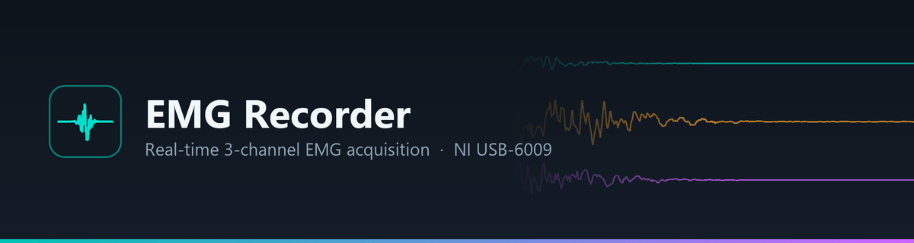
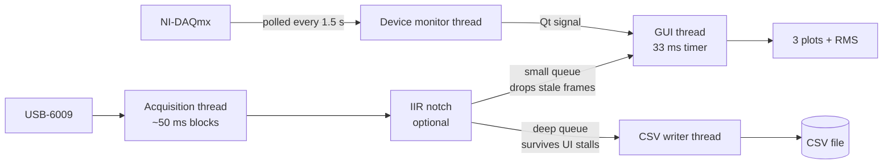

<div align="center">



<br>

**Real-time three-channel EMG acquisition, visualisation and recording for the NI USB-6009.**

<br>

[](#-requirements)
[](#-requirements)
[](#-requirements)
[](#-requirements)
[](#-requirements)
[](#-performance)

[Quick start](#-quick-start) · [Usage](#-usage) · [Notch filter](#-notch-filter) · [How it works](#-how-it-works) · [Performance](#-performance) · [Build](#-building-the-executable) · [Troubleshooting](#-troubleshooting)

</div>

---

## 📸 Screenshots

<!-- To add real screenshots:
     1. Run the app, capture with Win+Shift+S
     2. Save as docs/screenshot-dark.png and docs/screenshot-light.png
     3. Delete this comment block and uncomment the table below -->

<!--
<div align="center">
<table>
<tr>
<td></td>
<td></td>
</tr>
<tr><td align="center"><sub>Dark theme</sub></td><td align="center"><sub>Light theme</sub></td></tr>
</table>
</div>
-->

> [!NOTE]
> Screenshots pending — run the app and drop them into `docs/`.

---

## ✨ Features

<table>
<tr>
<td width="50%" valign="top">

### 📡 Acquisition
- Three simultaneous analog channels
- **10 Hz – 16 kHz** per channel
- Input mode: DAQmx default, Differential, RSE
- **Simulation mode** — full UI with synthetic EMG, no hardware needed

</td>
<td width="50%" valign="top">

### 📈 Display
- Live scrolling traces, **0.25 – 30 s** window
- Peak (min/max) decimation — a 30 s window draws as fast as a 1 s one
- Adjustable voltage range, **±5 V** default
- Per-channel RMS on its **own** averaging window

### 🔇 Notch filter
- Digital **IIR notch** for mains hum, toggled from the panel
- Configurable frequency (**50/60 Hz**), Q, and harmonic count
- Applied to the traces **and** to the CSV, so both always agree

</td>
</tr>
<tr>
<td width="50%" valign="top">

### 💾 Recording
- CSV written on a dedicated thread — the UI never blocks on disk I/O
- Fed straight from the acquisition thread, so a UI hiccup drops display frames but **not recorded samples**
- Any output folder, remembered between sessions

</td>
<td width="50%" valign="top">

### 🎨 Interface
- 🌙 Dark and ☀️ light themes, remembered
- Live device status: model, name, serial
- Plug/unplug detected while running
- Disconnect raises a pulsing alert, flashes the taskbar, and closes the recording cleanly

</td>
</tr>
</table>

---

## 🚀 Quick start

<details open>
<summary><b>Option A — standalone executable</b> (no Python needed)</summary>

<br>

Download **`EMG Recorder.exe`** from the [Releases](../../releases) page and double-click it.
Python, PySide6, NumPy and pyqtgraph are all bundled inside.

> [!WARNING]
> Windows shows *"Windows protected your PC"* because the file is not code-signed.
> Click **More info → Run anyway**. This appears for any unsigned program.

</details>

<details>
<summary><b>Option B — run from source</b></summary>

<br>

```bash
pip install PySide6 pyqtgraph numpy nidaqmx
python "Data collect2.py"
```

</details>

---

## 📋 Requirements

| | Requirement |
|:--|:--|
| 🖥️ **OS** | Windows 10 / 11 (64-bit) |
| 🐍 **Python** | 3.9 or newer (developed on 3.14) |
| 📦 **Packages** | `PySide6` · `pyqtgraph` · `numpy` · `nidaqmx` |
| 🔌 **Hardware** | NI USB-6009, or another NI-DAQmx analog input device |
| ⚙️ **Driver** | [NI-DAQmx](https://www.ni.com/en/support/downloads/drivers/download.ni-daq-mx.html) |

> [!IMPORTANT]
> **The NI-DAQmx driver is a separate system install and cannot be bundled into the executable.**
> Without it the app still launches and simulation mode works fully — it just cannot read real
> signals. The status panel names exactly what is missing.

---

## 🎛️ Usage

Press **▶ Start acquisition**, then **● Start recording** to write a file.

| Control | What it does |
|:--|:--|
| **Device** | NI device name, e.g. `Dev1` — auto-filled when a device is detected |
| **Channel 1–3** | Physical channels, e.g. `ai0`, `ai1`, `ai2` |
| **Sample rate** | Per channel. 3 × 2000 Hz = 6 kS/s aggregate |
| **Display window** | How much history the plots show |
| **RMS window** | Averaging time for the RMS readout — shorter reacts faster |
| **Voltage min / max** | Vertical scale of all three plots |
| **Input mode** | DAQmx default recommended; Differential and RSE force a configuration |
| **Notch frequency** | Mains frequency to remove — 50 Hz here, 60 Hz in the Americas |
| **Notch Q** | Higher Q = narrower notch = less EMG removed with the hum. −3 dB bandwidth is `frequency / Q` |
| **Notch harmonics** | How many multiples to notch. Harmonics at or above Nyquist are skipped |
| **◎ Notch filter** | Toggles the filter on the traces and on everything recorded |
| **Browse…** | Where CSV recordings are written |

### 📄 Output format

Files are named `EMG_<YYYYMMDD>_<HHMMSS>.csv` and land in `Documents\EMG Recordings` by default:

```csv
time_s,channel_1_V,channel_2_V,channel_3_V
0.000000,-0.031006,0.008046,0.009817
0.000500,-0.029053,0.007568,0.011230
```

> [!TIP]
> `time_s` starts at zero when **acquisition** starts, not when recording starts — so separate
> recordings from one session stay aligned on a common timeline.

> [!IMPORTANT]
> With the notch filter on, the CSV contains **filtered** samples — the raw signal is not
> retained. Such files are named `EMG_<date>_<time>_notch50Hz.csv` so the processing is
> visible from the filename alone. The filter controls are frozen while recording, so a
> single file never mixes processing.

---

## 🔇 Notch filter

Mains hum at 50 Hz (or 60 Hz) sits squarely in the EMG band and is usually the largest
thing in a raw recording. The **◎ Notch filter** button applies a cascade of second-order
IIR notches — one per harmonic — to the live traces and to everything written to CSV.

| Setting | Default | Notes |
|:--|:--:|:--|
| Frequency | `50 Hz` | 50 Hz in Sri Lanka, Europe and most of Asia; 60 Hz in the Americas |
| Q | `30` | −3 dB bandwidth is `frequency / Q`, so 50 Hz at Q 30 is ≈1.7 Hz wide |
| Harmonics | `3` | Notches 50, 100 and 150 Hz. Anything at or above Nyquist is skipped |

The coefficients are **bit-identical to `scipy.signal.iirnotch`**, but computed directly so
the application keeps no scipy dependency — scipy would roughly double the executable for
five lines of algebra. Filter state is carried across acquisition blocks, so a continuous
stream filters exactly as if it had been one long array.

Measured on a 25 Hz tone buried under 50/100/150 Hz hum:

| Component | Result |
|:--|:--|
| 25 Hz signal | **−0.0 dB** — untouched |
| 50 Hz hum | **−114 dB** |
| 100 Hz hum | **−177 dB** |
| 150 Hz hum | **−207 dB** |

Cost is **0.40 % of one core** at 2 kHz × 3 channels (3.2 % at 16 kHz), and it runs on the
acquisition thread — never the GUI thread.

---

## ⚙️ How it works

Three background threads keep the GUI free. The UI thread only ever touches already-summarised data.



Two design decisions do the heavy lifting:

#### 🪣 Peak-decimating ring buffer

Each channel keeps roughly **1200 `(min, max)` buckets** instead of every sample. Appending costs
`O(new samples)`; drawing costs `O(1200)` regardless of window length. Because each bucket keeps
*both* extremes, fast transients survive — a square wave still renders with vertical edges.

#### ➗ Running sum of squares

The RMS window maintains a running total rather than re-reducing the whole window every frame,
with a periodic re-sum to stop floating-point drift accumulating.

---

## 📊 Performance

Measured with a 10 ms heartbeat timer over 10 s while acquiring **and** recording.
The score is how many of 1000 ticks the Qt event loop actually serviced.

| Version | 2 kHz / 5 s window | Worst UI stall |
|:--|:--:|:--:|
| ❌ Naive — deque of floats, CSV on the UI thread | 65 / 1000 | **907 ms** |
| ✅ This implementation | **629 / 1000** | **49 ms** |
| ⚪ *An idle Qt window on the same machine* | *747 / 1000* | *23 ms* |

The naive version froze the interface roughly **93 % of the time**. The current one runs close to
the machine's own ceiling, and holds up at 16 kHz × 3 channels with a 30 s window — **480,000
samples per channel on screen**.

---

## 🔨 Building the executable

```bash
pip install pyinstaller
pyinstaller "EMG Recorder.spec" --noconfirm
```

Output: **`dist/EMG Recorder.exe`** — a single file, roughly 70 MB.

If this folder lives in OneDrive, build elsewhere so intermediates are not synced on every build:

```bash
pyinstaller "EMG Recorder.spec" --noconfirm --workpath %TEMP%\emgbuild
```

> [!NOTE]
> The spec copies `.dist-info` **metadata** for `nidaqmx`, `nitypes`, `hightime`, `deprecation`,
> `tzlocal` and `packaging`. `nitypes` calls `importlib.metadata.version()` at import time, and
> PyInstaller does not bundle metadata by default — without this the entire `nidaqmx` import fails
> and the app reports the library as unavailable **on machines that do have the driver installed.**

---

## 📁 Project structure

| | Path | Purpose |
|:--:|:--|:--|
| 📄 | `Data collect2.py` | The application — a single file |
| ⚙️ | `EMG Recorder.spec` | PyInstaller build definition |
| 🖼️ | `app_icon.ico` | Application icon |
| 🖼️ | `cover4.jpg` | Control-panel backdrop |
| 🖼️ | `cover5.jpg` | Plot-area backdrop |
| 📂 | `docs/` | README artwork |
| 📦 | `dist/` | Build output — not committed |

---

## 🧰 Troubleshooting

<details>
<summary><b>“NI-DAQmx UNAVAILABLE” although the driver is installed</b></summary>

<br>

The status panel prints the underlying exception beneath the headline. A `PackageNotFoundError`
means a **packaging** problem, not a driver problem — see the build note above.

</details>

<details>
<summary><b>“Device is busy”</b></summary>

<br>

Close NI MAX test panels, or any other software currently holding the device.

</details>

<details>
<summary><b>“Samples were overwritten”</b></summary>

<br>

The host could not keep up with the configured rate. Lower the sample rate.

</details>

<details>
<summary><b>Plots are empty but the device is connected</b></summary>

<br>

Check that the channel names match your wiring (`ai0`–`ai7` on a USB-6009), and that the voltage
range covers your signal.

</details>

<details>
<summary><b>Slow first launch</b></summary>

<br>

The one-file executable unpacks itself to a temporary folder on first run, taking 5–10 seconds.
Subsequent launches are quicker.

</details>

---

## 📝 Notes

- The executable is **Windows-only**. macOS and Linux need a build made on that platform, and
  NI-DAQmx support there is limited.
- `EMG Recorder.exe` is around **70 MB** — too large to commit comfortably (GitHub warns above
  50 MB and blocks at 100 MB). Attach it to a GitHub **Release** rather than tracking it in the
  repository.

## 📜 License

No license file yet. Without one, others have **no legal right** to use the code —
pick one at [choosealicense.com](https://choosealicense.com) before publishing.

<div align="center">
<br>
<sub>Built with <a href="https://www.qt.io/qt-for-python">PySide6</a> · <a href="https://www.pyqtgraph.org/">pyqtgraph</a> · <a href="https://numpy.org/">NumPy</a> · <a href="https://nidaqmx-python.readthedocs.io/">nidaqmx</a></sub>
</div>
