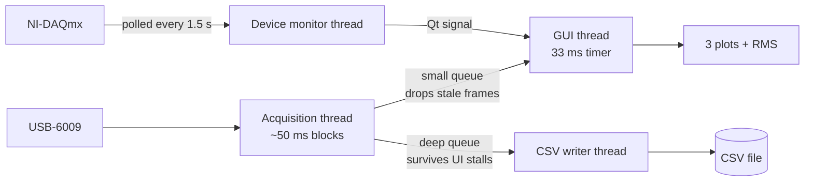

# EMG Recorder — NI USB-6009

A real-time three-channel EMG viewer and recorder for the National Instruments
USB-6009, built with PySide6 and pyqtgraph.

Streams three analog inputs, draws them live, shows a fast per-channel RMS
readout, and records to CSV without dropping samples — while staying
responsive at rates the naive implementation could not handle.


---

## Screenshots

<!-- Replace with real screenshots:
     1. Run the app, capture with Win+Shift+S
     2. Save as docs/screenshot-dark.png and docs/screenshot-light.png
     3. Delete this comment and uncomment the images below -->

<!--  -->
<!--  -->

_Screenshots to be added._

---

## Features

**Acquisition**
- Three simultaneous analog channels (configurable device and channel names)
- Sample rates from 10 Hz to 16 kHz per channel
- Selectable input mode: DAQmx default, Differential, or RSE
- Simulation mode — the full interface with synthetic EMG, no hardware required

**Display**
- Live scrolling traces with a configurable window (0.25–30 s)
- Peak (min/max) decimation, so a 30 s window at 16 kHz draws as fast as a 1 s window
- Adjustable voltage range, ±5 V by default
- Per-channel RMS with its **own** averaging window, independent of the plot window

**Recording**
- CSV written on a dedicated thread — the UI never blocks on disk I/O
- Recording is fed straight from the acquisition thread, so a UI hiccup drops
  display frames but **never** recorded samples
- Choose any output folder; the choice is remembered between sessions

**Interface**
- Light and dark themes, remembered between sessions
- Live DAQ connection status: model, device name and serial number
- Plug and unplug detected automatically while running
- A disconnect raises a pulsing alert, flashes the taskbar, and closes the
  recording cleanly rather than losing it

---

## Quick start

### Option A — standalone executable (no Python needed)

Download `EMG Recorder.exe` from the [Releases](../../releases) page and
double-click it. Python, PySide6, numpy and pyqtgraph are all bundled.

Windows shows *"Windows protected your PC"* because the file is not
code-signed → **More info** → **Run anyway**.

### Option B — run from source

```bash
pip install PySide6 pyqtgraph numpy nidaqmx
python "Data collect2.py"
```

---

## Requirements

| | |
|---|---|
| OS | Windows 10/11 (64-bit) |
| Python | 3.9+ (developed on 3.14) |
| Packages | `PySide6`, `pyqtgraph`, `numpy`, `nidaqmx` |
| Hardware | NI USB-6009 (or another NI-DAQmx analog input device) |
| Driver | [NI-DAQmx](https://www.ni.com/en/support/downloads/drivers/download.ni-daq-mx.html) |

> **The NI-DAQmx driver is a separate system install and cannot be bundled.**
> Without it the app still runs and simulation mode works fully, but it cannot
> read real signals. The status panel shows exactly what is missing.

---

## Usage

| Control | What it does |
|---|---|
| **Device** | NI device name, e.g. `Dev1` (auto-filled when a device is detected) |
| **Channel 1–3** | Physical channels, e.g. `ai0`, `ai1`, `ai2` |
| **Sample rate** | Per channel. 3 × 2000 Hz = 6 kS/s aggregate |
| **Display window** | How much history the plots show |
| **RMS window** | Averaging time for the RMS readout — shorter reacts faster |
| **Voltage min / max** | Vertical scale of all three plots |
| **Input mode** | DAQmx default is recommended; Differential and RSE force a configuration |
| **Browse…** | Where CSV recordings are written |

Press **Start acquisition**, then **Start recording** to write a file.

### Output format

`EMG_<YYYYMMDD>_<HHMMSS>.csv`, written to `Documents\EMG Recordings` by default:

```csv
time_s,channel_1_V,channel_2_V,channel_3_V
0.000000,-0.031006,0.008046,0.009817
0.000500,-0.029053,0.007568,0.011230
```

Time starts at zero when *acquisition* starts, not when recording starts, so
recordings stay aligned to the acquisition timeline.

---

## How it works

Three background threads keep the GUI free. The UI thread only ever touches
already-summarised data.



Two design points do the heavy lifting:

**Peak-decimating ring buffer.** Each channel keeps ~1200 `(min, max)` buckets
rather than every sample. Appending costs `O(new samples)`; drawing costs
`O(1200)` regardless of window length. Because each bucket keeps both extremes,
fast transients survive — a square wave still shows vertical edges.

**Running sum of squares for RMS.** The RMS window maintains a running total
instead of re-reducing the whole window every frame, with a periodic re-sum to
stop floating-point drift accumulating.

### Why it matters

Measured with a 10 ms heartbeat timer over 10 s while acquiring **and**
recording. The score is how many of 1000 ticks the event loop serviced:

| Version | 2 kHz / 5 s window | Worst UI stall |
|---|---|---|
| Naive (deque of floats, CSV on the UI thread) | 65 / 1000 | **907 ms** |
| This implementation | 629 / 1000 | **49 ms** |
| *An idle Qt window on the same machine* | *747 / 1000* | *23 ms* |

The naive version froze the interface roughly 93% of the time. The current one
runs near the machine's own ceiling, and holds up at 16 kHz × 3 channels with a
30 s window — 480,000 samples per channel on screen.

---

## Building the executable

```bash
pip install pyinstaller
pyinstaller "EMG Recorder.spec" --noconfirm
```

The result is `dist/EMG Recorder.exe` (~70 MB, single file).

If this folder lives in OneDrive, build elsewhere so intermediates are not
synced on every build:

```bash
pyinstaller "EMG Recorder.spec" --noconfirm --workpath %TEMP%\emgbuild
```

> The spec copies `.dist-info` **metadata** for `nidaqmx`, `nitypes`,
> `hightime`, `deprecation`, `tzlocal` and `packaging`. `nitypes` calls
> `importlib.metadata.version()` at import time and PyInstaller does not bundle
> metadata by default — without this the whole `nidaqmx` import fails and the
> app reports the library as unavailable on machines that *do* have the driver.

---

## Project structure

```
├── Data collect2.py      # the application (single file)
├── EMG Recorder.spec     # PyInstaller build definition
├── app_icon.ico          # application icon
├── cover4.jpg            # control-panel backdrop
├── cover5.jpg            # plot-area backdrop
└── dist/                 # build output (not committed)
```

---

## Troubleshooting

**"NI-DAQmx UNAVAILABLE" although the driver is installed**
The panel prints the underlying exception. A `PackageNotFoundError` means a
packaging problem, not a driver problem — see the build note above.

**"Device is busy"**
Close NI MAX test panels or other software holding the device.

**"Samples were overwritten"**
The host could not keep up — lower the sample rate.

**Plots are empty but the device is connected**
Check the channel names match your wiring (`ai0`–`ai7` on a USB-6009) and that
the voltage range covers your signal.

**Slow first launch**
The one-file executable unpacks to a temp folder on first run, taking 5–10
seconds. Later launches are quicker.

---

## Notes

- The executable is Windows-only. macOS and Linux need a build made on that
  platform, and NI-DAQmx support there is limited.
- `EMG Recorder.exe` is ~70 MB — too large to commit comfortably (GitHub warns
  above 50 MB and blocks at 100 MB). Attach it to a GitHub **Release** instead
  of tracking it in the repository.

---

## License

No license file yet. Without one, others have no legal right to use the code —
pick one at [choosealicense.com](https://choosealicense.com) before publishing.
